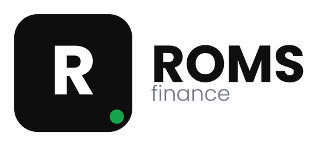
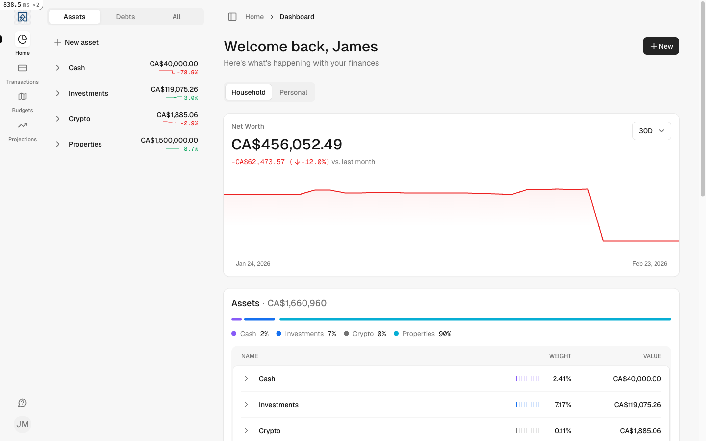
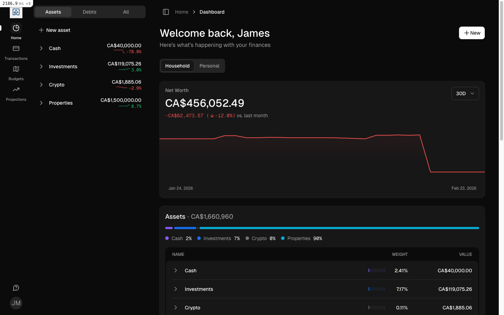
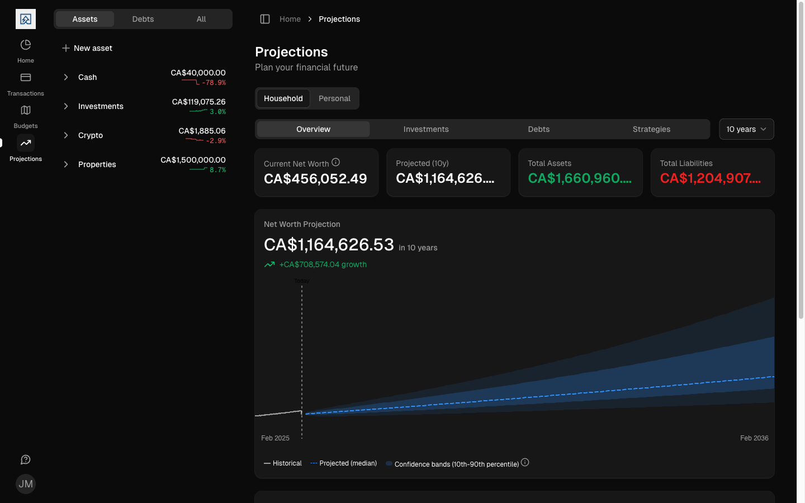
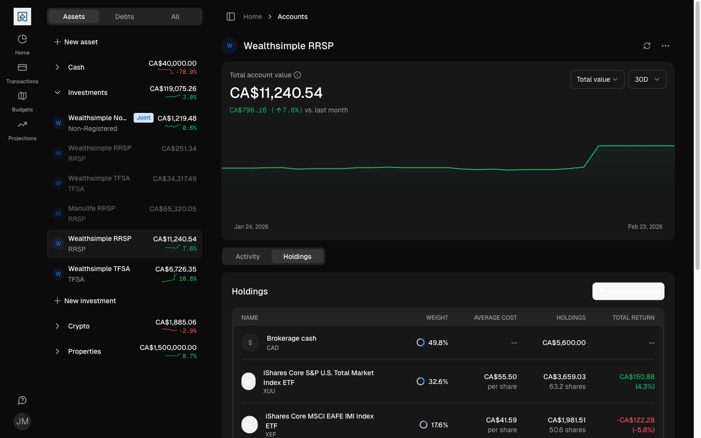
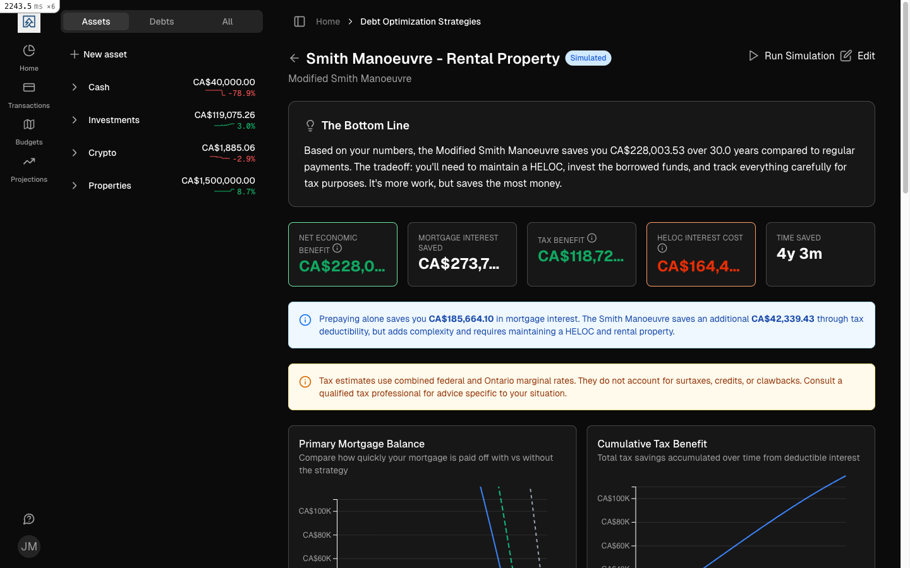
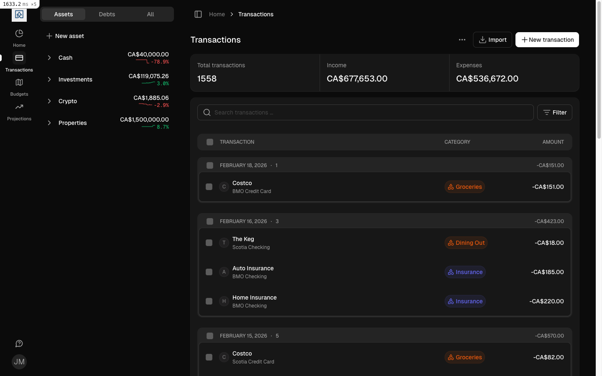

<p align="center">
  
</p>

<h1 align="center">ROMS Finance</h1>

<p align="center">
  Self-hosted personal finance for Canadians who want control of their data.
</p>

<p align="center">
  <a href="LICENSE"></a>
  <a href="https://github.com/RubenOussoren/roms-finance/actions/workflows/ci.yml"></a>
  
  
  
</p>

<p align="center">
  
</p>

---

## Features

| Feature | Description |
|---|---|
| Multi-Account Tracking | Chequing, savings, credit cards, investments, crypto, loans, and properties |
| Investment Projections | Monte Carlo confidence bands with PAG 2025 compliance |
| Canadian Debt Optimization | Smith Manoeuvre simulator with 3-way comparison and CRA audit trail |
| SnapTrade Brokerage | Auto-sync Wealthsimple, Questrade, and other Canadian brokerages |
| Plaid Banking | Connect chequing, savings, credit cards, and loans (US and EU) |
| Tax-Aware Calculations | Federal + provincial Canadian tax brackets (all provinces) |
| Per-User Privacy | Household and personal views with granular account visibility |
| Dark Mode | Full dark theme with system preference detection |
| AI Assistant | Natural language queries about your finances (OpenAI) |
| Self-Hostable | Single Docker Compose file, runs on x86 and arm64 (Raspberry Pi) |

## Screenshots

<details>
<summary>Dark Mode</summary>


</details>

<details>
<summary>Investment Projections</summary>


</details>

<details>
<summary>Account Detail with Holdings</summary>


</details>

<details>
<summary>Smith Manoeuvre Debt Strategy</summary>


</details>

<details>
<summary>Transactions</summary>


</details>

## Quick Start (Self-Hosting)

```bash
curl -O https://raw.githubusercontent.com/RubenOussoren/roms-finance/main/compose.example.yml
SECRET_KEY_BASE=$(openssl rand -hex 64) docker compose -f compose.example.yml up -d
# Open http://localhost:3000 — first user becomes admin
```

That's it. PostgreSQL, Redis, Sidekiq, and the web server are all included.

For reverse proxy setup, SMTP configuration, and provider API keys, see the [full Docker guide](docs/hosting/docker.md).

## Optional Integrations

All providers auto-disable when unconfigured. Set the relevant environment variables in your `compose.example.yml` to enable them. Alpha Vantage can also be configured in Settings > Self-Hosting.

| Provider | Region | Connects | Guide |
|---|---|---|---|
| [SnapTrade](https://snaptrade.com) | Canada | Investment and crypto brokerages (Wealthsimple, Questrade, etc.) | [Docker guide](docs/hosting/docker.md) |
| [Plaid](https://plaid.com) | US, EU | Bank accounts, credit cards, loans | [Docker guide](docs/hosting/docker.md) |
| [Alpha Vantage](https://www.alphavantage.co) | Global | Stock prices, exchange rates (25 free calls/day) | [Docker guide](docs/hosting/docker.md) |
| [OpenAI](https://platform.openai.com) | Global | AI-powered financial assistant | [Docker guide](docs/hosting/docker.md) |

## Development Setup

> If you want to **self-host** the app, use the [Quick Start](#quick-start-self-hosting) above instead.

### Prerequisites

- Ruby 3.4 (see `.ruby-version`)
- PostgreSQL 16+
- Redis

### Setup

```sh
git clone https://github.com/RubenOussoren/roms-finance.git
cd roms-finance
cp .env.local.example .env.local
bin/setup
bin/dev
```

Visit http://localhost:3000. Seeds create a realistic Canadian family with 20 accounts, 37 months of transactions, investment holdings, and a pre-simulated Smith Manoeuvre strategy.

| Credential | Email | Password | Role |
|---|---|---|---|
| Admin | `admin@roms.local` | `password` | Full access |
| Member | `member@roms.local` | `password` | Per-user privacy demo |

To reload demo data from scratch: `rake demo_data:default`

## Contributing

See [CONTRIBUTING.md](CONTRIBUTING.md) for guidelines.

### Roadmap Highlights

The next features planned (from the [Feature Roadmap](docs/FEATURE_ROADMAP.md)):

- **Retirement / FIRE Calculator** -- Model withdrawal strategies, safe withdrawal rates, and FIRE timelines
- **Historical Net Worth Chart** -- Visualize net worth over time with account-level drill-down
- **Emergency Fund Tracker** -- Track progress toward a configurable emergency fund target

## Tech Stack

- **Backend:** Ruby on Rails 7.2, PostgreSQL 16, Redis, Sidekiq
- **Frontend:** Hotwire (Turbo + Stimulus), Tailwind CSS v4, D3.js
- **Infrastructure:** Docker Compose, GitHub Actions CI, arm64 support

## License

ROMS Finance is distributed under the [AGPLv3 license](LICENSE).

This project is based on [Maybe Finance](https://github.com/maybe-finance/maybe). "Maybe" is a trademark of Maybe Finance, Inc. This project is not affiliated with or endorsed by Maybe Finance, Inc.
