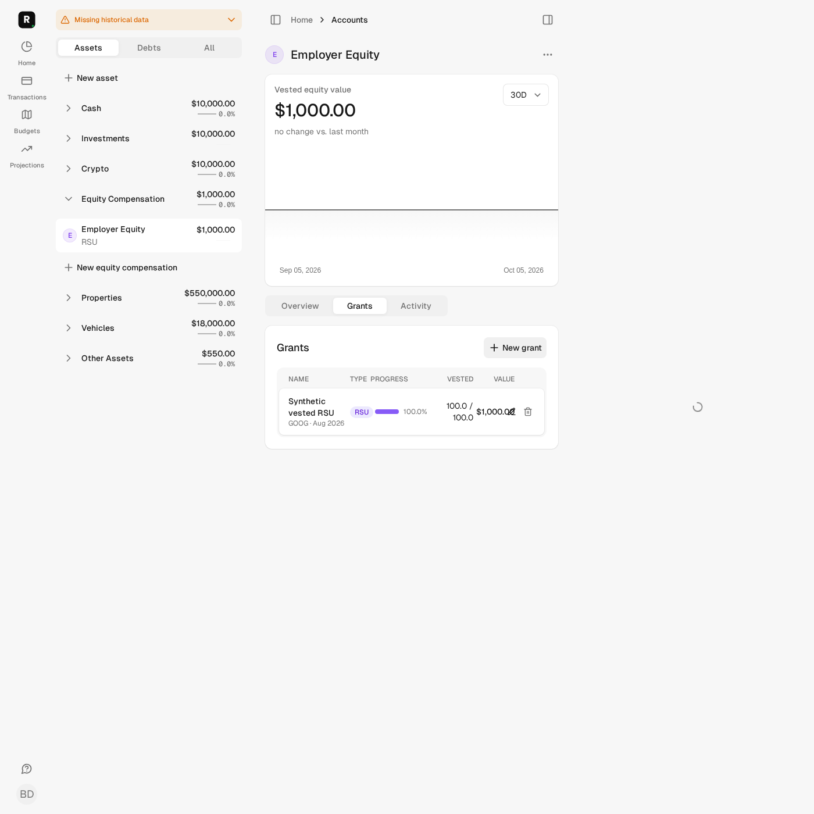
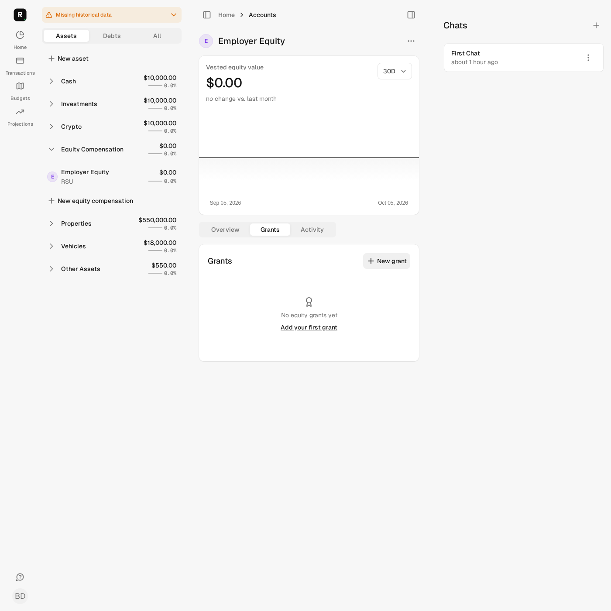
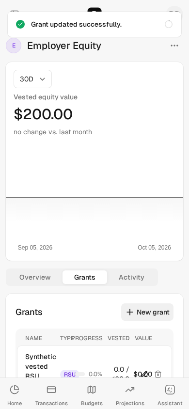

# Issue #122 — obsolete vesting valuations

## Scope and user journey

An empty grant list or future-only vesting schedule previously returned before
removing generated valuations or synchronizing account history. Four new model
regressions reproduced that defect before the fix (32 tests, 61 assertions,
4 expected failures, no errors/skips).

Regeneration now reaches the existing transaction and inline sync even with an
empty schedule, skipping historical-price imports when there are no dates.
Only prefix-marked `Vesting: ` valuation entries are removed. Opening anchors,
manual observations and signed transactions remain governed by the existing
forward calculator. This is not a new financial assumption or reconciliation policy.

Grant routes now use the existing family-scoped full-access relation. Investigation
of review-suggested negative coverage found that the prior accessible relation also
admitted balance-only viewers to grant details/mutations. The change enforces the
existing documented policy; creator/joint/default-full behavior is unchanged.

No schema, dependency, FX, provider, consent, sharing-default or rollout changes.
No retained data, live providers or production were accessed.

## Independently expected values

Synthetic RSU: 100 vested units × USD 10 = USD 1,000, with the scenario clock fixed
to 2026-10-05. Real inline synchronization and forward materialization run; market
price/import boundaries are stubbed.

| Regeneration after removal/future-only edit | Expected persisted current balance |
| --- | ---: |
| No other entries/anchor | USD 0 |
| USD 200 opening anchor | USD 200 |
| USD 200 opening plus later manual USD 350 observation | USD 350 |
| USD 200 opening − USD 50 withdrawal + USD 20 contribution | USD 170 |

Tests assert repeated regeneration, retained entries, materialized history and
completed sync—not merely the intermediate `accounts.balance` assignment.
Hidden/balance-only/cross-family edit, update and delete requests return 404 without
changing grants, entries or sync counts. A full-access member can still delete.

## Fresh local evidence

Checks use `bin/autonomy-check` under the common phase lock, after verification of
the existing owned synthetic database and dedicated Redis. No preparation,
migration, reset, installation or retained-service startup/restart was performed.

Validated pre-commit HEAD: `ecc4c1e65e9ef049a73cb100394e66bc65a657f4`.
Final application/test source manifest:
`723ab5dc88aebe06b472dd5d3ee5239117c4e61d416877c85200f876e311ff7a`.

| Exact command | Result |
| --- | --- |
| `bin/autonomy-check preflight` | Pass: resource identity, test DB/Redis, empty credentials/dotenv, test jobs/mail, blocked external Ruby HTTP |
| `bin/autonomy-check assets:precompile` | Pass: generated assets from isolated capture |
| `bin/autonomy-check test test/models/equity_compensation_test.rb test/controllers/equity_grants_controller_test.rb` | 49 tests, 246 assertions; 0 failures/errors/skips |
| `AUTONOMY_BROWSER_EVIDENCE=true bin/autonomy-check test test/system/equity_grant_regeneration_test.rb` | 2 tests, 22 assertions; 0 failures/errors/skips |
| `bin/autonomy-check test` | 2,081 tests, 10,354 assertions; 0 failures/errors, 16 existing skips |
| `bin/autonomy-check rubocop` | 1,079 files; no offenses |
| `bin/autonomy-check brakeman` | 0 errors/active warnings; 5 existing ignored warnings; obsolete ignore entry reported |
| `bin/autonomy-check js-lint` | 54 files; no fixes/findings |
| `bin/autonomy-check zeitwerk:check` | Pass; existing non-eager-loaded directory warnings |
| `bin/autonomy-check docs` | Pass |

Security/JS/loading/docs used manifest
`de66ed3b0f5d9244ba7d303f807b46e066f8ef8e826fc77dcc85d32d5f18787a`,
before the test-only clock-freeze addition. Full/focused/browser/Ruby lint were
repeated after that addition. The evidence document/screenshots were added later;
final committed SHA/digest and CI results are recorded on the PR.

Initial request validation lacked generated Tailwind assets; isolated precompilation
settled it. Initial desktop browser scaffolding expected a native confirmation,
then an ephemeral toast; it was corrected to interact with the existing custom
Confirm dialog and assert the durable grant empty state and displayed/persisted
balance. These were test-harness corrections, not unsuccessful implementation
repair approaches.

## Synthetic desktop/mobile browser evidence

Desktop deletion completes the existing grant confirmation, displays USD 0 and
no grants, and retains that result on revisit. Mobile edits the grant into the
future, displays USD 200, preserves its opening anchor and retains that result on
revisit. Screenshots contain synthetic fixtures only; no live pricing or providers.

## Independent read-only review and limits

Independent review found no blockers. Signed-transaction and negative-access
suggestions were addressed; the final short source follow-up completed previously
truncated inspection and approved the bounded change on code-review grounds.
Reviewers did not execute runtime checks. The follow-up noted the scenario's
clock was not frozen; it is now fixed explicitly and validation repeated.

Local full-system coverage and dependency audits are delegated to the configured
CI gates; their actual outcome must be verified on the PR before readiness.
Broad formatting/ERB lint is unrun (no templates changed). Existing suite skips,
price/FX fallback semantics, vesting-boundary defects and broader sale correction
remain outside this issue. Prefix-based generated-entry identification and sync's
existing failure/transaction behavior are unchanged; this is not concurrency or
provider-failure certification.

Mission counters: 2/5 cumulative cycles, 0/2 unsuccessful distinct repair approaches,
at most one implementation PR. Prior #151/#132/#141 history and publication outcomes
are preserved privately. No merge or deploy authorized/performed.
