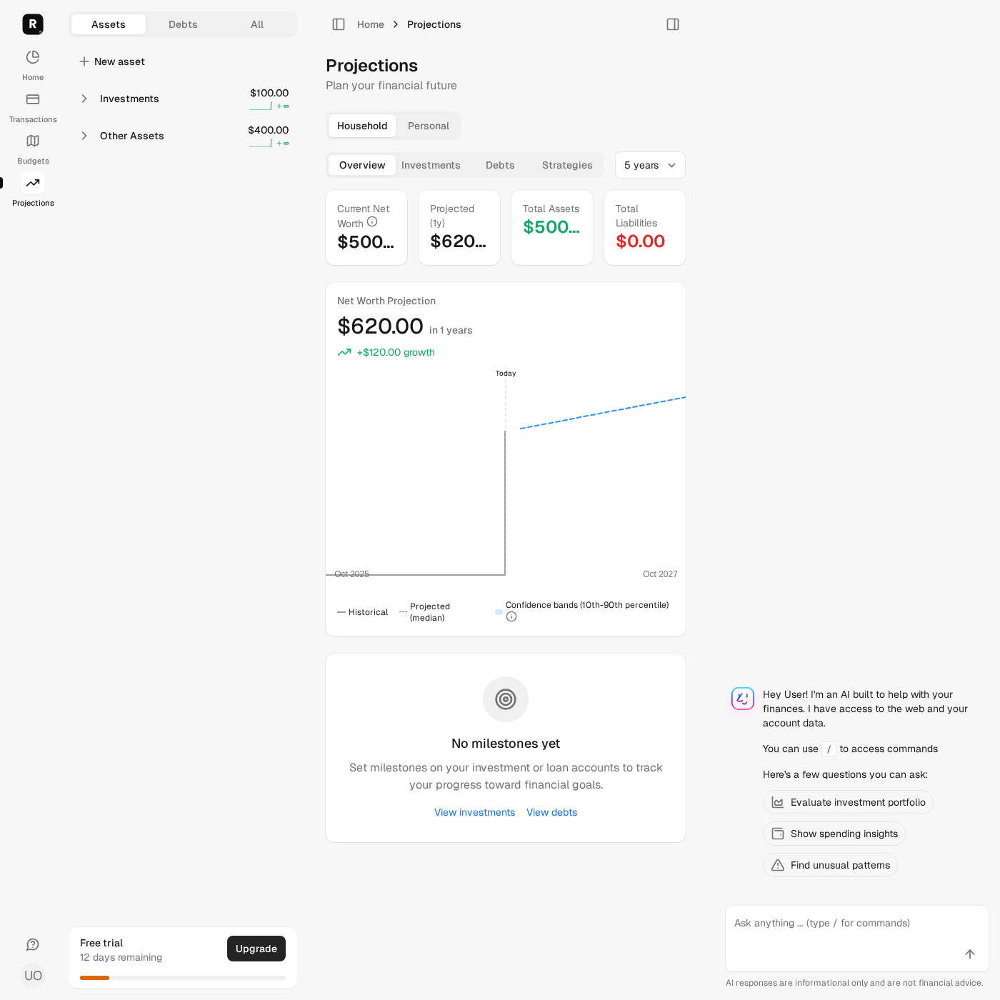
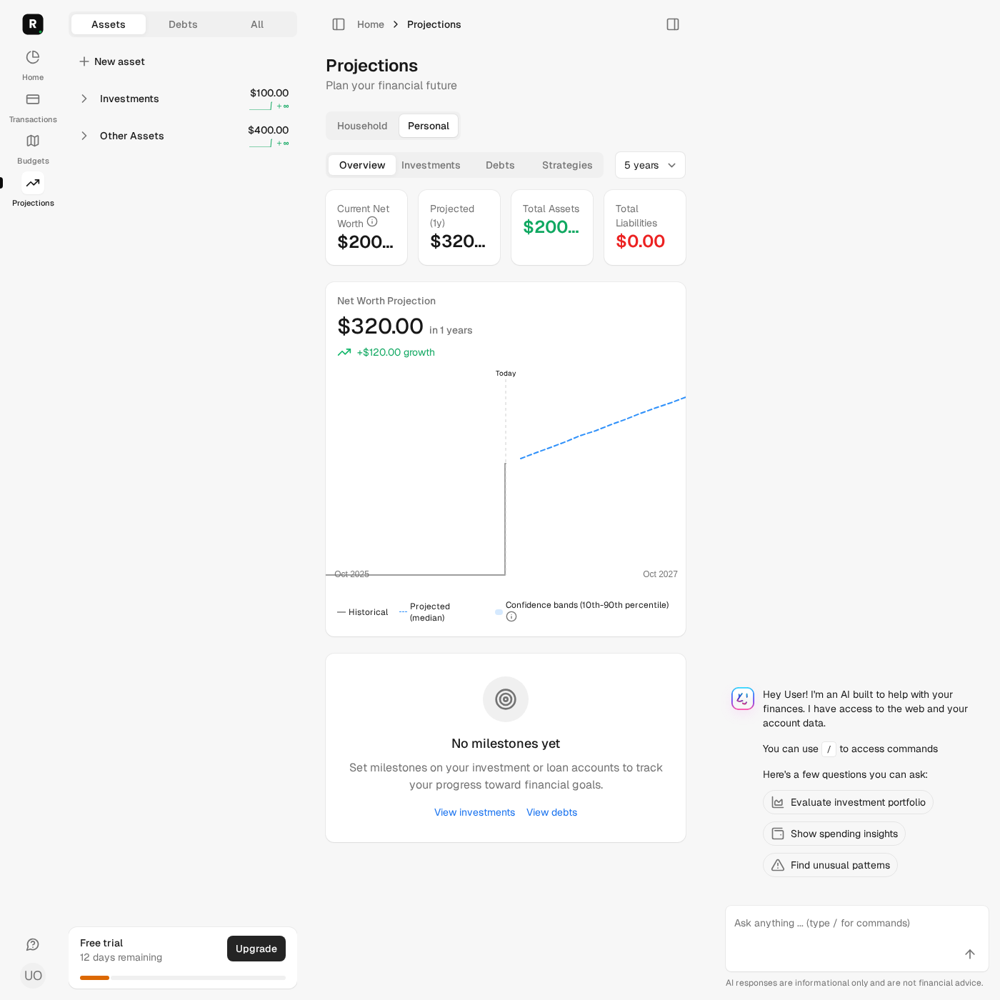
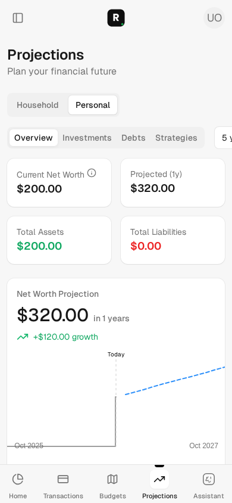

# Issue #132 — viewer-scoped projection growth

These are synthetic automated browser observations, not a production reproduction
or a human usability study. No live provider data or credentials were used.

## Scenario and independently expected values

The viewer has a USD 100 investment with synthetic zero return/volatility and
USD 10 monthly contributions, plus balance-only access to a USD 400 asset with
25% personal ownership. Another member owns a hidden USD 900 asset. A separate
family has a USD 7,000 asset; neither restricted amount belongs in this overview.

After 12 months, the investment is `100 + 12 × 10 = 220`:

| Scope | Current / latest history | Forecast | Growth |
| --- | ---: | ---: | ---: |
| Household | USD 500 | USD 620 | USD 120 |
| Personal | USD 200 | USD 320 | USD 120 |

The household includes the full accessible asset balance; the personal view uses
its 25% ownership fraction. The hidden account has no ownership row for this
viewer. This scenario does not certify every combination of ownership and access.

The component additionally checks the issue's minimal USD 100 → USD 200 case,
negative/zero growth, missing projections, and currency formatting. Request
coverage changes the hidden asset from USD 900 to USD 9,000 after advancing time
to change the cache version; all disclosed household values remain unchanged.

Before the fix, deterministic request tests reached the correct scoped current,
history and forecast values but failed the `+$120.00 growth` assertion in both
scopes: **15 tests, 46 assertions, 2 failures, zero errors/skips**. No pre-fix
browser screenshot is claimed. The chart subtracted an unrestricted USD 1,400
family total, producing USD -780 household / USD -1,080 personal growth.

## Fix and observed journey

The overview passes its existing authorized `balance_sheet.net_worth_money` to
the chart. The component has no family reference or unscoped balance-sheet lookup.
Projection calculations, currency conversion, sharing defaults and financial
assumptions are unchanged; only the disclosed growth anchor is corrected.

The desktop browser visits the household overview, switches to Personal and back,
and checks the specific headline/chart elements, serialized history/forecast and
rendered chart SVG. Mobile repeats the personal overview at 390×844. Screenshots
show current USD 200, projected USD 320 and +USD 120 growth without hidden names.
The existing horizon selector can display its default 5y label for a 1y URL;
that separate settings/horizon issue is not changed by this scoped anchor fix.

## Validation evidence

- Existing verified sandbox, disposable `roms_autonomy_test` DB and dedicated
  `roms-autonomy-test-redis`; frozen branch-matched temporary source captures.
- Empty dotenv/application credentials, test jobs/mail, external Ruby HTTP blocked,
  browser requests restricted to the current local Capybara server.
- Fresh capture HEAD: `e493e0a399841eadb0249653b0215b1cdd2b1a43` plus source manifest
  SHA256 `2ddb87a7317ff2b3daf1b924793155a61b99b7d4f4ae5667e6702ae59b582cac`.
  This capture includes final implementation/test refinements, before this evidence
  document and screenshot copies; later published-HEAD checks are recorded on the PR.
- `bin/autonomy-check test test/controllers/projections_controller_test.rb test/components/ui/projections/net_worth_projection_chart_test.rb test/calculators/family_projection_calculator_test.rb`:
  **45 tests, 168 assertions, zero failures/errors/skips**.
- `AUTONOMY_BROWSER_EVIDENCE=true bin/autonomy-check test test/system/projection_scope_test.rb`:
  **2 tests, 32 assertions, zero failures/errors/skips**.
- `bin/autonomy-check test`: **2,064 tests, 10,165 assertions, zero failures/errors,
  16 existing skips**. No skip was added by this change.
- `bin/autonomy-check rubocop`: **1,075 files, no offenses**.
- `bin/autonomy-check brakeman`: **zero errors/active warnings; 5 existing ignored
  warnings and one obsolete ignore entry reported**.
- `bin/autonomy-check js-lint`: **54 files, no fixes/errors**.
- `bin/autonomy-check zeitwerk:check` and `bin/autonomy-check docs`: passed;
  Zeitwerk reports existing non-eager-loaded directories.
- Independent read-only review found no blockers and independently checked the
  arithmetic. Its suggestions were addressed: element-specific browser assertions
  and clock advancement before hidden-value mutation. Focused/browser checks were
  repeated successfully afterward.

Local dependency-advisory audits and the entire system suite are not represented
by these results; configured CI owns those gates. Full-suite skips include existing
API scope/retry, AutoSync, i18n, provider-configuration and performance coverage
limitations. Existing mixed-currency behavior, chart continuity, cache granularity
and broader ownership/visibility combinations are not certified by this fix.

### Desktop household

### Desktop personal

### Mobile personal

