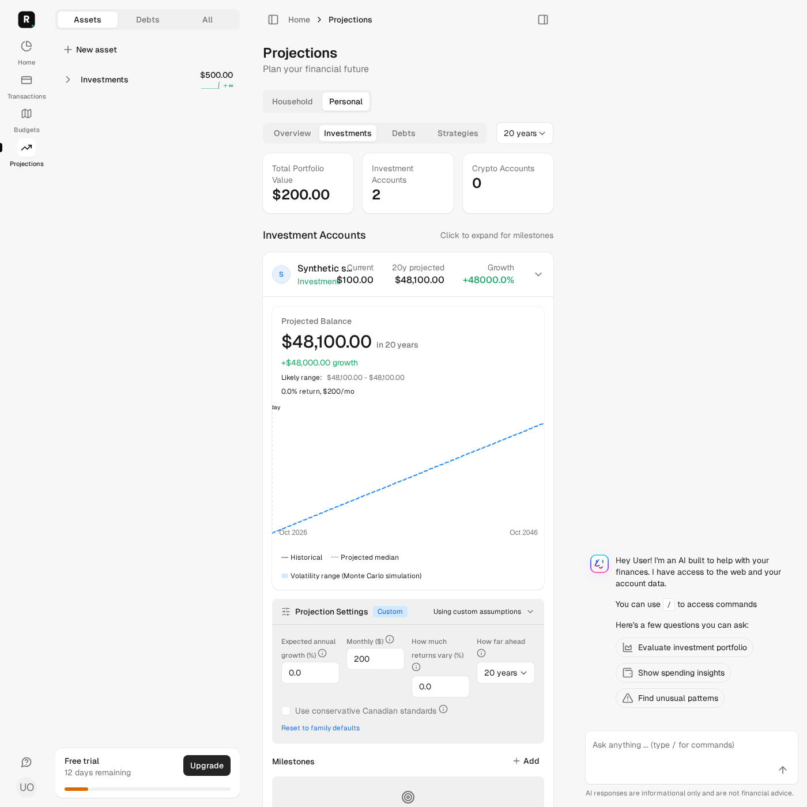
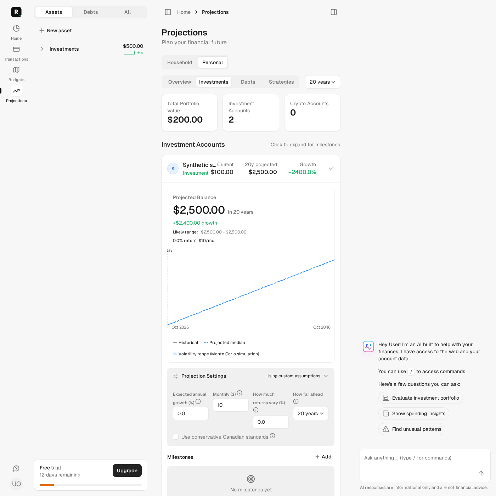
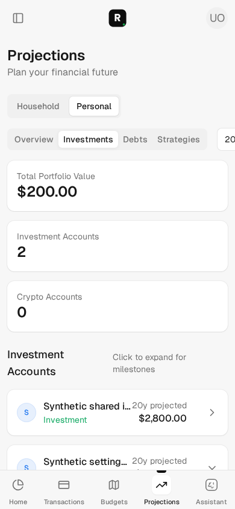
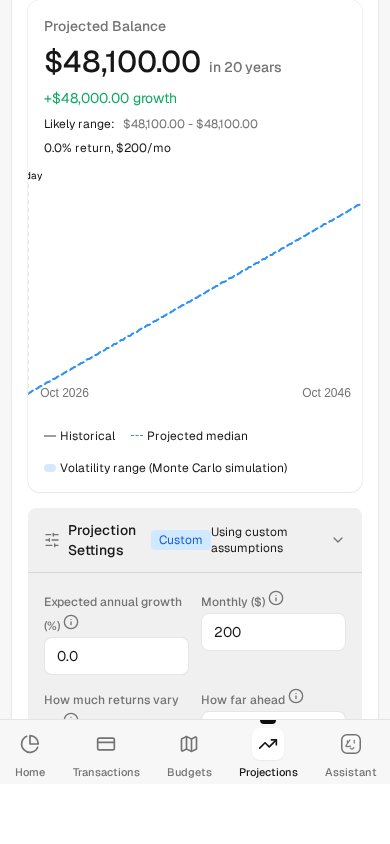
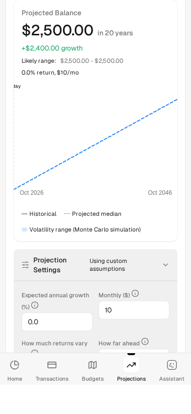

# Projection settings context — issue #137

## Bounded change and observed defect

Mission #137 only, based on main `60d94586d9e8587b50ae6786fa8ae5339f1d86b7`.
Source inspection confirmed that HTML redirects discarded scope/horizon, reset
submitted neither, and Turbo patched only chart/settings while the collapsed
account summary retained obsolete projected values. The reset button also produced
a form inside the update form. This is source evidence, not a pre-fix browser run.

Update and reset now return a 303 redirect to the validated originating tab,
scope and horizon. Turbo refreshes the enclosing projection frame and replaces
its URL context; HTML follows the same GET. Reset submits its own complete context
outside the update form. The horizon toolbar also preserves URL state. The shared
safe defaults are documented in the [workflow](../../development/workflow.md).
The settings account lookup remains `scoped_accounts.find`, without new access
policy. No projection calculations, currencies, guideline defaults, upper horizon
limits, schema, dependencies, provider calls or financial assumptions changed.

## Independently expected synthetic values

Synthetic USD investments: viewer owns a $100 account; another $400 account is
25% owned by the viewer. A hidden $900 investment must never appear. Household
portfolio is **$500**; Personal portfolio is **$200 = 100 + 400 × 25%**.
Family assumptions are 0% return, 0% volatility and $10 monthly contribution.

- Personal / Investments / **20 years**: account projection **$2,500 = 100 + 10 × 240**.
- Update monthly contribution to $200: **$48,100 = 100 + 200 × 240**, growth **$48,000**.
- Reset: **$2,500**, growth **$2,400**, $10/mo, no account-specific assumption.
- Every monthly chart percentile equals `100 + contribution × month` in this
  zero-volatility scenario. Card summary and chart headline agree.
- Personal Overview includes ownership-weighted contributions: after update
  **$48,800 = 48,100 + (400 + 10 × 240) × 25%**; after reset **$3,200**.
  A rapid second update to $300 gives **$72,800**. These are existing ownership
  semantics, not a new financial rule.

Both HTML and Turbo requests assert exact redirects and freshly rendered summary
values. Browser tests exercise scope switching, update/reset, reload and Back.
A stronger stale-history check navigates the original tab Home *before* mutation;
a second local browser tab updates settings; Back on the original tab must fetch
$48,100 instead of restoring $2,500. Desktop is 1400×1400; mobile windows, including
the second editing tab, are 390×844. No external provider is involved.

## Independent review and dependent freshness

Independent read-only review found two relevant freshness gaps in the first patch:
a body meta tag did not control Turbo snapshot caching, and resetting a non-latest
assumption could leave Overview's server cache unchanged. Both were fixed:

- The no-cache directive is yielded into the document **head**. Frame navigation
  begins from the full projection page; its existing head directive remains active.
- Overview cache versions hash every assumption ID and microsecond timestamp,
  detecting creation, non-latest updates and deletion. Regression tests run with
  a real MemoryStore and an unrelated newer assumption, plus same-second updates.

Final read-only implementation review found no blockers; a capped follow-up read
all three new test files in full. Its low-risk suggestion was addressed: hidden
and cross-family rejection tests now seed assumptions and verify their complete
attributes remain unchanged after both rejected actions.

## Browser evidence and visual limitations

Screenshots were inspected, not merely generated. Personal context, portfolio,
account projection and growth agree with the independent expectations above.
Mobile context and chart are separate captures because the page scrolls.

Existing narrow-layout issues remain: the mobile top horizon selector overflows
horizontally; long account names crowd desktop card columns; the chart's Today
label is clipped at the left edge. Numeric chart headlines are readable. This
mission does not redesign cards/charts or certify mixed-currency projections.
Whole-frame refresh collapses expanded cards/settings, which can be reopened.

## Validation provenance and safety

All Rails checks use `bin/autonomy-check` under the common nonblocking phase lock,
from the reconciled worktree. Fresh preflight verifies the approved sandbox,
synthetic-only `roms_autonomy_test`, dedicated `roms-autonomy-test-redis`, empty
credentials/dotenv, test jobs/mail and blocked external HTTP. No schema loading,
migration, reset, manual data preparation, dependency installation, retained-service
startup/restart or production access occurred.

Fresh focused regression: **29 tests / 364 assertions / zero failures, errors or skips**.
Fresh two-window desktop/mobile browser regression before the final height assertion:
**2 tests / 24,938 assertions / zero failures, errors or skips**. Full unit/integration,
Rubocop, Brakeman, JS lint, Zeitwerk and docs checks passed during implementation;
exact final committed HEAD, frozen source-manifest digest and fresh complete results
are recorded in the PR and private checkpoint, rather than self-referentially in this
file. Local dependency audits and full system coverage are supplied by required CI;
no local helper command supports advisory audits or standalone ERB lint.

Mission bounds: one implementation PR, two of five cycles used, zero unsuccessful
distinct repair approaches. Earlier mission histories remain preserved privately.
Merge/deployment are not authorized by this mission or by successful validation.
