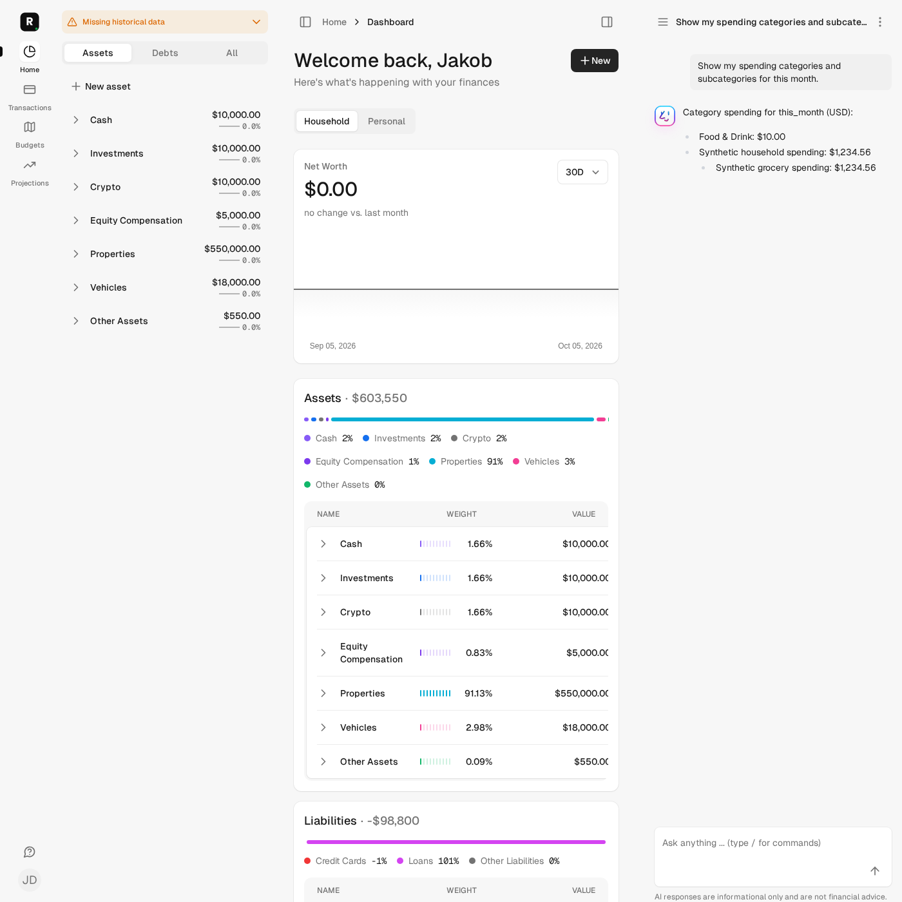

# Issue #141 — Numeric category spending

## Scope and independently expected results

`GetCategories` previously formatted sums before calling `to_f` for inclusion.
For USD 1,234.56, `"$1,234.56".to_f` is zero: positive parents and children
were omitted. The tool now retains Money values through numeric filtering and
formats only returned presentation fields. Response fields, order, positive-entry
selection, periods and viewer full-access scope are unchanged.

Independent expectations exercised by the unit regression:

- Parent expenses USD 1,000 + 234.56 = **1,234.56**; child expenses 20.25 + 4.75
  = **25.00**, with separate numeric and formatted assertions.
- A zero parent remains if its child has positive spending; an unused category
  and a child with only negative entries remain omitted under the existing
  positive-entry spending query.
- A positive USD 0.004 parent or child remains even though display rounds to
  `$0.00`; the actual numeric amount, not display rounding, determines inclusion.
- A changed presentation (`USD 1,234.56`) cannot affect inclusion.
- Balance-only, hidden, foreign-family and out-of-period expenses cannot affect
  the tested viewer's USD 12.34 category result. Increasing restricted expenses
  leaves the complete result unchanged.

No currency conversion, financial assumption, access/consent policy, schema,
provider configuration or rollout change. Mixed-currency aggregation remains
separate issue #142; this evidence makes no completeness or FX claim.

## Synthetic browser journey

A synthetic family member submits “Show my spending categories and subcategories
for this month.” through the actual chat form. The response job is stubbed:
no live provider or model is called. The test executes the actual category tool
for that viewer, persists an AssistantMessage built verbatim from its result,
then reloads the conversation to inspect existing rendering. This validates
prompt persistence and grounded output on desktop/mobile, **not** LLM tool
selection/generation, outbound serialization, streaming or ActionCable delivery.

Parent and child each independently have USD 1,234.56 spending; both are retained
and readable. The known-zero category is absent. The fixture's Food & Drink
USD 10 remains visible. Screenshots were inspected: chat amounts and prompt are
readable in desktop sidebar and 390 × 844 mobile; the mobile header title has
existing truncation, not response clipping. Dashboard fixture history is not
certified by this category-only mission.

## Fresh local validation

All Rails checks used `bin/autonomy-check` with the common phase lock, verified
existing synthetic `roms_autonomy_test` and dedicated `roms-autonomy-test-redis`,
frozen source and external-provider guards. No preparation, migrations, resets,
installations or retained-service modifications were performed.

Captured HEAD: `3c070f2af2f7dd618679efa61c78dcd38e9bb3c8` (dirty worktree).

| Exact command | Result | Source-manifest SHA256 |
| --- | --- | --- |
| `bin/autonomy-check preflight` | Pass: isolated resources, empty credentials/dotenv, test jobs/mail, external HTTP blocked | `18a96ecebabbbca8de44a5895fbcb156be0746b3472cef3da17286b4c3b3fccc` |
| `bin/autonomy-check test test/models/assistant/function/get_categories_test.rb` (before fix) | 5 tests, 4 assertions, 4 failures / 1 nil-parent error; positive categories missing | `b50b33f60358bd56afd8736d4d947861e6ecdf25c5c53361488326b869346915` |
| `bin/autonomy-check test test/models/assistant/function/get_categories_test.rb` | 6 tests / 31 assertions, zero failures/errors/skips | `a8413e2bef37dae5f8cbe5675bf5014f28f27b0b5132fd24d4e22b6dbaad9fa8` |
| `bin/autonomy-check assets:precompile` | Pass; approved generated assets only | `bd26a34513611322951cf7b3fa7b306ea1d53fb0f78da040acc13cef3c9ec7c2` |
| `AUTONOMY_BROWSER_EVIDENCE=true bin/autonomy-check test test/system/category_spending_chat_test.rb` | 2 tests / 37 assertions, zero failures/errors/skips | `5823172f665b82958c8a0f44405ab207090bd2c64074913f25bf110f9dcb9448` |
| `bin/autonomy-check test` | 2,070 tests / 10,196 assertions, zero failures/errors, 16 reported skips (same count as prior mission; not removed) | `a8413e2bef37dae5f8cbe5675bf5014f28f27b0b5132fd24d4e22b6dbaad9fa8` |
| `bin/autonomy-check rubocop` | 1,077 files, no offenses after fixing two array-spacing offenses in the new test | `01e2cadb966553beddfcf69057074884cfa34c11744c9c0f0696432c049de36a` |
| `bin/autonomy-check brakeman` | Zero active warnings/errors, five existing ignored warnings | same `01e2cadb…` capture |
| `bin/autonomy-check js-lint` | 54 files, pass, no fixes | same `01e2cadb…` capture |
| `bin/autonomy-check zeitwerk:check` | Pass; existing non-eager-loaded directories warning remains | same `01e2cadb…` capture |
| `bin/autonomy-check docs` | Pass | same `01e2cadb…` capture |
| `git diff --check` | Pass | local diff |

The full/focused capture precedes a whitespace-only test fix; browser capture
precedes the added subcent-child unit case. Final publication validation and CI
are reported on the PR, not inferred from these earlier captures. Local dependency
audits and full system suite are not claimed here: the helper has no advisory-audit
command; configured CI owns those gates. No broad formatting or ERB-lint pass is
claimed (no templates changed).

## Independent read-only review and mission boundaries

Independent reviewer found **no blocking correctness/privacy regression**, approved
with a low-priority suggestion to cover a zero parent with a subcent child. That
case was added and passed in the six-test focused run and full suite above.
The reviewer did not rerun tests. Primary orchestrator inspected the final diff
and both screenshots.

Selected only #141 after verifying #158 merged/#132 closed and no open PRs.
#140 still lacks a reviewed disclosure contract for unlinked provider accounts
and balance-only strategies; no policy was invented. Prior #132 and #151 histories,
counters and outcomes are retained privately. Mission: **2/5 cycles, 0/2 unsuccessful
distinct repair approaches, one implementation PR maximum**. Numeric approach
succeeded; the isolated test-spacing correction did not introduce another approach.
No merge, deployment or production access is authorized/performed.
