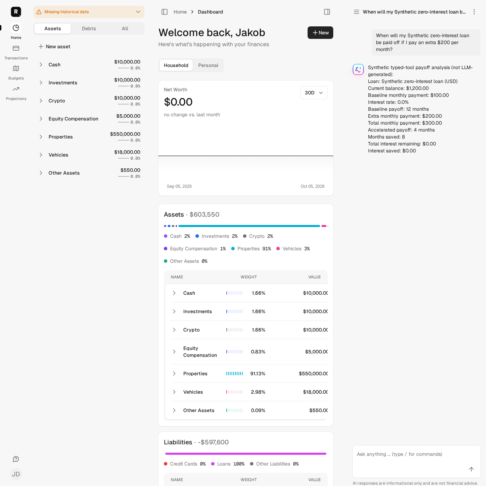
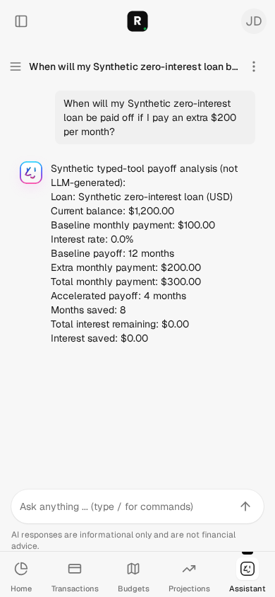

# Typed assistant tool boundary — issue #144

## Scope and observed defect

Mission #144 only: preserve Assistant::Function parameter schemas at the locked
RubyLLM 2.0.0 tool boundary and reject malformed arguments before execution.
No migrations, dependencies, financial assumptions, account scopes, sharing,
consent/memory policy, provider configuration or rollout changes.

On current-main base `a4ce86e665d7203c82672374d179ba889052ee26`, new adapter
regressions produced **5 tests / 9 assertions / 4 failures / 0 errors / 0 skips**
with source manifest `d0f9292abca93cf3087748aea40cab15389bc4d38afcd2a2bcd9f2c862f88e0c`:
all properties became strings, malformed values executed the function, and
transactions required an undeclared `page_size`.

## Boundary contract

RubyLLM 2.0.0 `Tool.parameters(schema)` preserves raw JSON Schema; its runtime
`Tool.call` checks the Ruby keyword signature, not value types. The adapter now
uses that raw schema API and validates the subset used by existing functions:
object/properties/required/additionalProperties, array/items/minItems/uniqueItems,
enum and scalar types. Unsupported keywords/types fail at registration rather
than silently bypassing checks. This is **not** a general JSON Schema engine;
future schema constraints require deliberate validator support and regression tests.

Arguments are not coerced. Required properties must be present; omitted optional
values are allowed; null is not a number/string. Non-finite numbers are refused.
Invalid calls return `error.type = invalid_arguments`, a correction message and
field-path details, and are logged through the existing tool-call persistence flow.
The function is not called on validation failure. Valid calls retain their types.

Transactions no longer require undeclared `page_size`; the server still controls
its fixed 50-row limit. Existing account visibility and financial calculations
remain in the functions/calculators, not in this validator.

## Synthetic user journey and independent numbers

Provider tests capture the actual outgoing tool definitions and run the real
RubyLLM HTTP loop with deterministic WebMock responses. Transaction account-name
arrays and integer pagination reach the real function. Numeric loan scenarios
reach the real calculator. A three-response sequence rejects string `"200"`,
then executes only corrected numeric `200`, then returns the final response.
Invalid mutation arguments are tested not to create an AiMemory record; no new
memory consent/sharing policy is asserted.

The desktop sidebar and mobile chat page submit a real prompt, persist it and
render a response constructed from the actual adapter/tool results. Synthetic
fixture loan: **USD 1,200 principal, 0% interest, USD 100 monthly payment**.
Independent expectations: baseline `1200 / 100 = 12` months; numeric extra payment
`200` gives `1200 / 300 = 4` months, **8 months saved and USD 0 interest**.
The monthly payment is stubbed for this synthetic case. Browser responses are
explicitly **not LLM-generated**. Jobs and ActionCable delivery are not exercised.

Visual inspection: the prompt and payoff values are readable in both layouts.
The desktop background has fixture-related missing-history/zero-net-worth output
and a narrow dashboard table; this mission does not claim to validate dashboard
numbers or redesign that unrelated layout.

## Fresh isolated validation

Commands were run from `automation/issue-144` using `bin/autonomy-check` under the
common phase lock. Preflight verifies the recorded sandbox, synthetic-only
`roms_autonomy_test` ownership and dedicated `roms-autonomy-test-redis` identity.
No schema loading, migration, reset, manual data preparation, service startup,
credential reads, dependency installation or live provider calls were used.

Application and final-test source capture: HEAD
`a4ce86e665d7203c82672374d179ba889052ee26` plus manifest
`dfcc06000e2ef0f0d44085ef4685e08ef0ed75a6b1605d760d4cffe22be74f38`.
The earlier browser capture was the same application and browser source, before
provider-test isolation changes, manifest
`729c85b75891a17507e7b33cca134856aaedccc0f6fa757d9de9ea3ed9699df9`.
These are dirty-worktree captures, not claims that base HEAD alone includes the fix.

| Exact helper command | Fresh result |
| --- | --- |
| `bin/autonomy-check preflight` | Pass: isolation, empty dotenv/credentials, test jobs/mail and external HTTP block |
| `bin/autonomy-check test test/models/provider/ruby_llm/function_tool_adapter_test.rb test/models/provider/ruby_llm_test.rb test/models/assistant/function_privacy_test.rb` | 27 tests, 141 assertions, 0 failures/errors/skips |
| `bin/autonomy-check assets:precompile` | Pass; isolated synthetic assets |
| `AUTONOMY_BROWSER_EVIDENCE=true bin/autonomy-check test test/system/typed_tool_chat_test.rb` | 2 tests, 77 assertions, 0 failures/errors/skips |
| `bin/autonomy-check test` | 2,092 tests, 10,447 assertions, 0 failures/errors, 16 existing skips |
| `bin/autonomy-check rubocop` | 1,082 files, no offenses |
| `bin/autonomy-check zeitwerk:check` | Pass; existing noneager-load directory warnings |
| `bin/autonomy-check brakeman` | 0 active warnings/errors, 5 existing ignored warnings; obsolete-ignore notice |
| `bin/autonomy-check js-lint` | 54 files, pass without fixes |
| `bin/autonomy-check docs` | Pass |

Existing skip sources include unconfigured Plaid tests, four i18n checks,
temporarily disabled auto-sync/account-scope checks, API retry debugging and the
API base-controller placeholder. No new skip or quarantine was added. Required
GitHub CI, including full system tests and advisory-network dependency audits,
must be verified on the PR; local helper results do not substitute for CI.

## Review and limitations

Independent read-only review found no must-fix issues. Its two suggestions were
addressed: actual malformed-to-corrected provider retry and fail-closed schema
registration regressions. A provider request-history isolation problem exposed
by the stronger assertions was fixed with per-test WebMock reset; checks were
rerun. No unsuccessful alternative implementation repair approach was needed.

No live model argument-generation/answer-quality claim is made. Schema typing
is not authorization, financial correctness or arbitrary string/date validation.
Existing tool financial/access/memory issues remain outside #144; in particular,
#140 still requires a reviewed balance-only field allowlist. This PR must not
be treated as resolving those policy-boundary issues.
