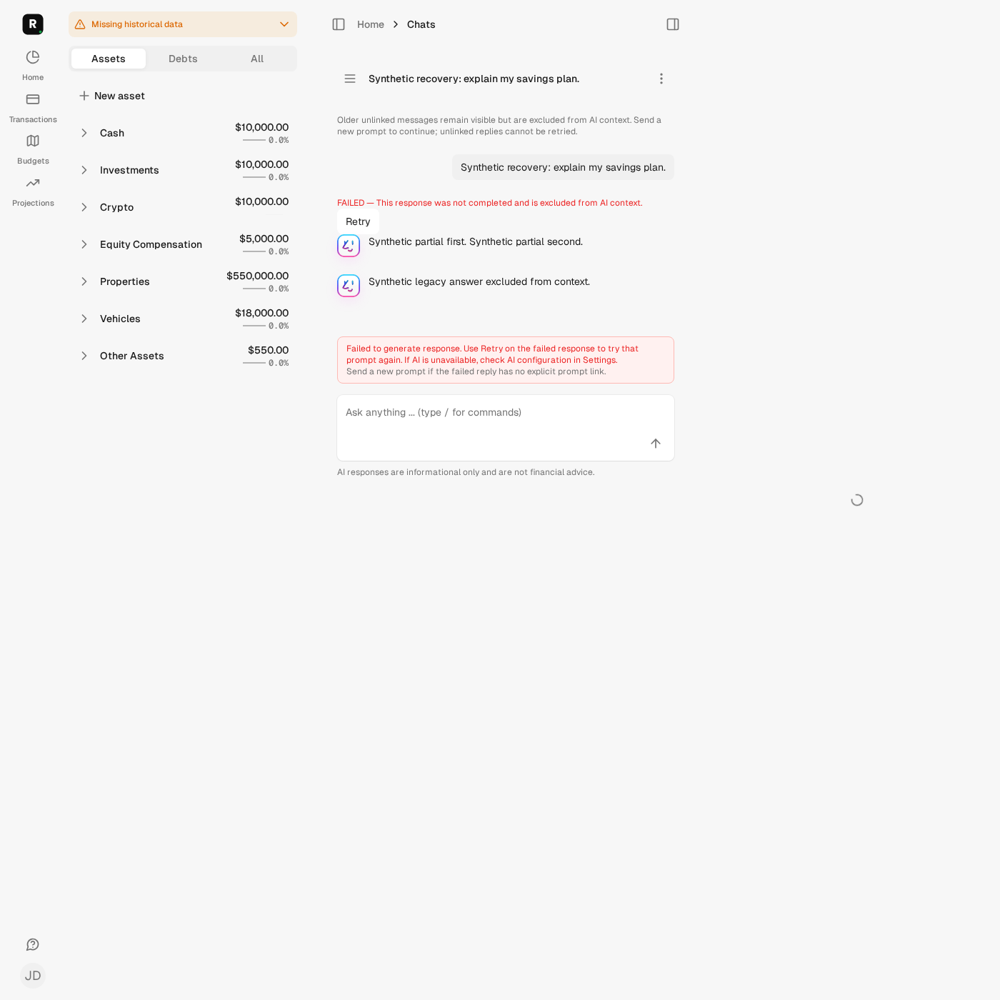
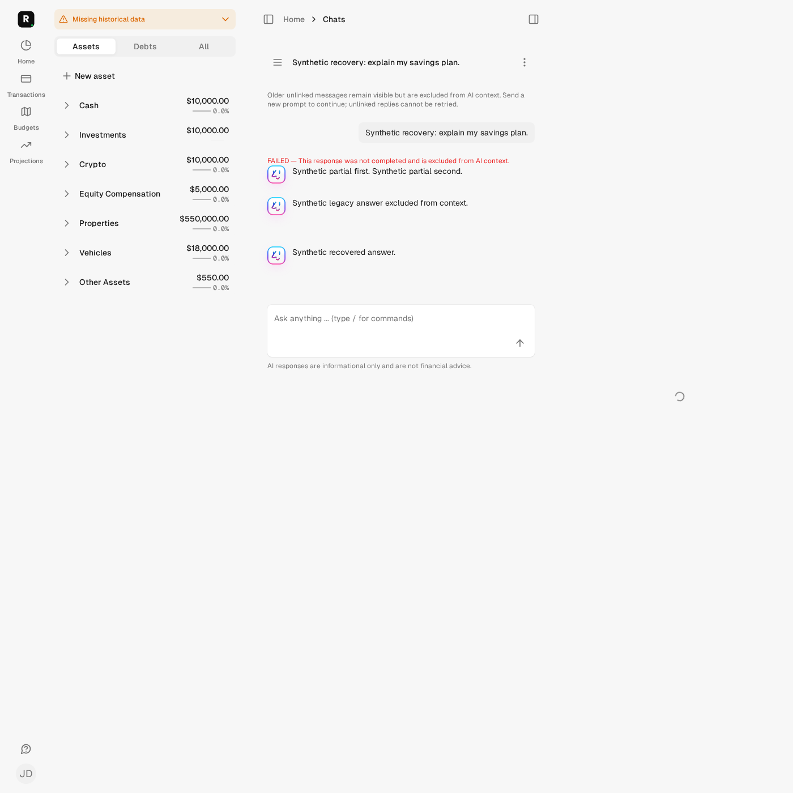
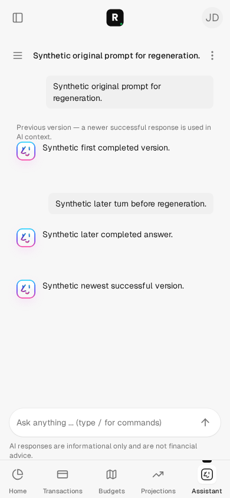
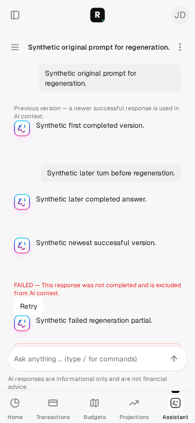
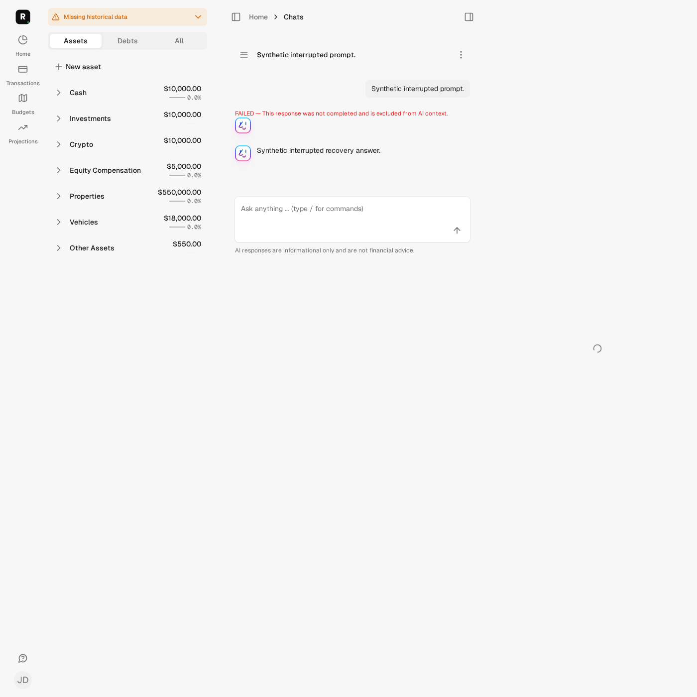

# Issue #145 — originating-prompt retry and regeneration

These are deterministic synthetic observations, not production reproduction,
live-provider validation, an LLM quality claim or a human usability study.

## Recoverable journey

The desktop user submits a real prompt. The synthetic provider streams two
chunks; each is independently persisted before a timeout. After reload the
partial reply is visibly FAILED, retains its text and offers Retry. A real Retry
click and a second browser POST of the stale form produce one replacement ID
and one job. The exact queued AssistantMessage is executed synchronously through
the real Assistant/Responder pipeline. Its original prompt and empty prior
context are captured; failed/legacy output is absent. The replacement completes
and the original failed reply remains visible.

On mobile a completed answer is regenerated after a later turn already exists.
The outbound prompt is the original prompt, not the latest turn, and its input
contains neither its own previous replies nor later turns. Prior completed
answers remain visible as previous versions. A subsequent failed regeneration
retains its partial output as failed and does not displace the newest success.
A follow-up's captured context contains that success, not failed/superseded text.

A third browser scenario reloads a claimed, idle attempt. Stop and retry explicitly
abandons that attempt after five minutes without a persisted update; its claim
and history remain, an old job cannot call the provider again, and the replacement
completes. No worker or recurring job is retained after these isolated tests.

## Implementation and approval

- Explicit user-turn ordering, origin/replacement links and attempt numbers; no
  timestamp-based origin inference, legacy backfill, branching or later-turn replay.
- Chat-lock reservation, unique-index backstops and a pre-dispatch durable claim.
  One UserMessage callback queues the precreated attempt; API duplicate enqueue removed.
- Pending/failed output excluded; newest successful answer per originating prompt
  is authoritative. Provider history is limited to eligible preceding turns.
- Row-locked output fences reject late content, tokens, tool records, completion,
  errors and thinking-indicator callbacks after explicit abandonment.
- Attempt-specific POST forms, duplicate-submit protection, retained FAILED and
  previous-version labels, singleton non-misrouting error banner and legacy warning.
- Existing chat authorization retained, with cross-user/chat source-ID negatives.
- Four approved additive migrations and a separately approved isolated upgrade;
  nullable legacy fields, concurrent uniqueness indexes, deferred same-chat FKs,
  separate constraint validation. Existing transactional deletion callbacks tested.

The [identity and rollout plan](../../development/issue-145-response-identity.md)
details the approved contract, compatibility and interruption semantics. Old queued
UserMessage jobs no-op rather than infer intent. Unlinked legacy transcript remains
visible but is excluded from provider context; users must submit an explicit prompt.
There are no financial-assumption, account-access, consent/retention-policy or
provider-model changes. #140 remains separate. Nothing is merged or deployed here.

## Fresh local checks

Branch `automation/issue-145`, based on main
`3677bb26f17e1931921ef418679a315fe6f13ded`. The comprehensive prepublication application/test/static capture
HEAD is that base, with frozen source-manifest SHA256
`7b1c592dfa7d7e650876fd462b72765f44251ec4fdb83a1b248f1edc4a107418`.
This evidence document, wording updates and a final empty-response failure-path
fix were added after that capture. The final fix has focused synthetic regression
coverage; fresh committed-HEAD full/browser/static checks are required below. Committed-HEAD checks and actual
GitHub CI outcomes belong in the PR handoff, not inferred from these dirty captures.

Commands ran under the common phase lock using `bin/autonomy-check`:

| Command | Result |
| --- | --- |
| `preflight` | Existing DB/Redis identity, empty credentials/dotenv, offline guards passed |
| `assets:precompile` | Isolated assets built with existing dependencies |
| `test test/tooling/autonomy_schema_guard_test.rb test/models/response_attempt_test.rb test/models/response_attempt_concurrency_test.rb test/jobs/assistant_response_job_test.rb test/models/assistant_test.rb test/models/assistant_message_test.rb test/models/chat_test.rb test/models/user_message_test.rb test/controllers/chats_controller_test.rb test/controllers/api/v1/messages_controller_test.rb` | 77 tests / 645 assertions / 0 failures / 0 errors / 0 skips, at preceding capture `ebd9e7b200075af2f8b67e88d8646be5d4097e94152520e8cc81deeb6ec4b2c3`; later test-only lock-observation fix verified with integration tests |
| `test test/models/response_attempt_concurrency_test.rb test/controllers/chats_controller_test.rb test/controllers/api/v1/messages_controller_test.rb` | 35 tests / 365 assertions / 0 failures / 0 errors / 0 skips |
| `test` | 2,162 tests / 11,480 assertions / 0 failures / 0 errors / 15 existing skips |
| `rubocop` | 1,100 files / 0 offenses |
| `brakeman` | 0 errors / 0 active warnings / 5 ignored warnings |
| `js-lint` | 54 files / no findings or fixes |
| `zeitwerk:check` | Passed; existing non-eager-loaded-directory warning |
| `docs` | Canonical adapters, skills and links passed before final evidence text |
| `PYTHONDONTWRITEBYTECODE=1 python3 -m unittest discover -s test/tooling -p autonomy_check_test.py -v` | 27 offline tests passed |

The synthetic browser command is
`AUTONOMY_BROWSER_EVIDENCE=true bin/autonomy-check test test/system/chat_response_recovery_test.rb`:
3 tests / 324 assertions / 0 failures / 0 errors / 0 skips at earlier manifest
`6da00b3305170dd3aaa7613b55f1761234d9b0b3e40fe278776632bbd0979d05`.
Final committed browser coverage is rechecked for the PR. Real PostgreSQL tests
assert distinct backend connections, observed row-lock contention, one replacement
enqueue and one provider invocation under simultaneous job delivery. Constraint
negatives, preserved claims and linked-chat/user callback destruction also pass.

The prior API retry skip was restored to real coverage. No new skips or weakened
assertions were introduced. The 15 local skips are existing i18n/API-scope/AutoSync
and unconfigured Plaid cases; full system tests and dependency audits are owned by
normal PR CI. Optional broader formatting and standalone ERB lint are unrun.
PostgreSQL emits two harmless transaction warnings on deliberately rejected
commit-time FK tests; existing Marcel frozen-string warnings remain.

## Review and corrections

Independent read-only schema and execution-tooling reviews identified lock lifetime,
deletion compatibility, failed-upgrade reconciliation and schema-publication safety
issues; those were addressed before the approved upgrade. Implementation review
identified permanent pending attempts and a wrong-source global retry action;
explicit fenced recovery and a non-actionable singleton banner resolved both.
Final implementation review found no blocker, subject to fresh full checks. The
optional late-thinking callback fence was then added and regression-tested. An
empty-success provider response now terminalizes as a recoverable failure even
after completion validation leaves dirty attributes; that path is regression-tested.

Initial controller checks lacked built Tailwind assets. An old streaming unit test
also required a real claimed attempt under the new fence; its assertions were kept.
A full-suite concurrency observation timed out because a cached initial activity
query could hide later row-lock contention. Observation now explicitly bypasses
Rails query caching and clears the PostgreSQL statistics snapshot; the same lock
and identity assertions are retained, and the fresh full suite passed.

### Validation safety incident, preserved

The first post-upgrade test invocation implicitly reconstructed the disposable DB
because the direct schema dumper had not updated Rails' fingerprint. This was
outside the approved migration-only operation. The next identity check refused
work on the missing ownership marker. Execution stopped and the capture-only
failure was supervised; no uncertain daemon work was deleted or retried.
After additional maintainer authority, DB schema/version/constraints/indexes/hash
and Redis identity were verified and only the original ownership comment restored.
A reviewed fail-closed guard now rejects automatic preparation, and the migration
helper records the dump fingerprint. No reset/load/rollback was used to recover.
This failed safety approach is counted and preserved, not described as success.

## Remaining boundaries

The five-minute action is explicit logical abandonment, not upstream cancellation
or proof that the previous process died; it cannot undo tool effects already run.
Local fresh-install schema loading, rollback and production-scale lock cost were
not tested or authorized. CI exercises the committed schema on fresh hosted test
resources. Existing skips remain outside #145; no screen-reader audit is claimed.
The mission uses one implementation PR, three cumulative cycles and one
unsuccessful safety approach. Full earlier mission histories remain private and
preserved; merge/deployment require separate maintainer action.
