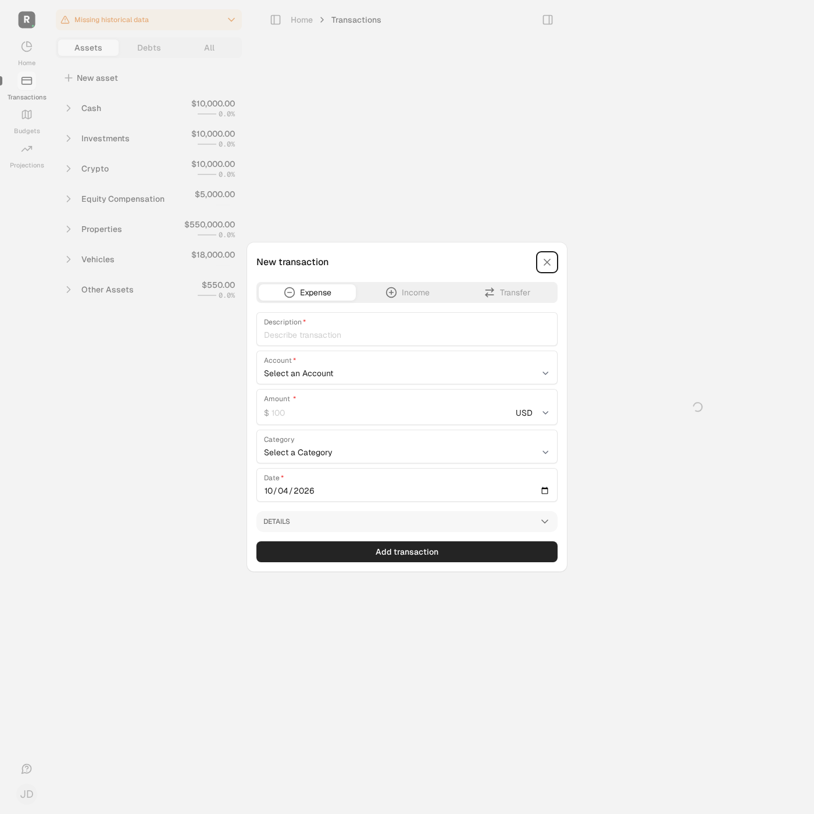
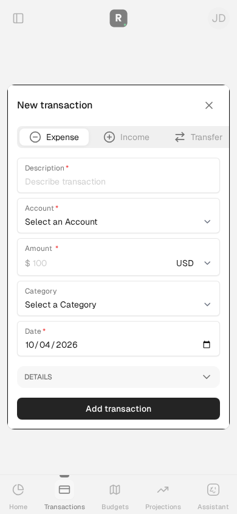
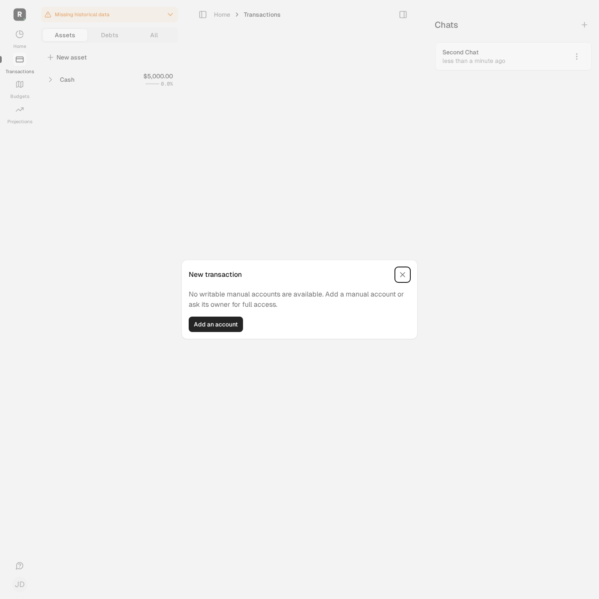

# Issue #151 — synthetic transaction account choices

These are automated browser observations, not a production reproduction or a
human usability study. All displayed users, accounts, balances and chats are
repository test fixtures. No live provider data or credentials were used.

## Scenario and expected outcome

A fictional family member opens **New transaction** with default-full manual
accounts, a balance-only credit card, a hidden loan and a connected account.
Only active manual full-access accounts are eligible in the generic picker.
Creator/joint overrides and explicit full access follow the existing policy.
Direct hidden, balance-only and foreign-family IDs must remain denied.

The member selects the permitted checking account, enters a synthetic expense
and successfully submits it. On mobile the same eligible choices are present.
When no writable manual accounts exist, the form is replaced with setup/access
guidance; **Add an account** opens the existing account-type chooser in its Turbo
frame (the page URL need not change).

## Environment and evidence

- Source: issue #151 working tree based on `014792a6`, immediately before the
  implementing commit; final test refinements included. No application behavior
  changed after this capture.
- Fixture pack: repository fixtures plus explicit member permissions in
  `TransactionAccountChoicesTest`; the unrelated synthetic support session is
  marked complete for the ordinary-member journey.
- Date observed: 2026-10-04. No price, FX, forecast or financial assumptions changed.
- Browser: Playwright 1.63.0 / Chrome for Testing 153.0.8010.12.
- Viewports: desktop 1400×1400; mobile 390×844.
- Existing sandbox runtime, branch-matched temporary source snapshot, disposable
  test database and dedicated test Redis. Empty dotenv/application credentials,
  test mail/jobs, external Ruby HTTP blocked, browser requests limited to the
  current local Capybara server.
- Command: `AUTONOMY_BROWSER_EVIDENCE=true bin/autonomy-check test test/system/transaction_account_choices_test.rb`.
- Result: **3 tests, 15 assertions; zero failures, errors or skips**.
- Controller coverage: **17 tests, 101 assertions; zero failures, errors or skips**,
  including exact option IDs/names, negative submissions, preselected IDs,
  creator/joint legacy restrictions, empty state and validation errors.
- Independent read-only implementation review found no blocking issue. Its
  test-strengthening suggestions were addressed and focused checks repeated.

The screenshots show the rendered form and empty state. Native select-option
contents are asserted by tests rather than claimed visible in the collapsed picker.
The pre-fix defect is source-confirmed; no pre-fix browser screenshot is claimed.

### Desktop form

### Mobile form

### No writable manual accounts

