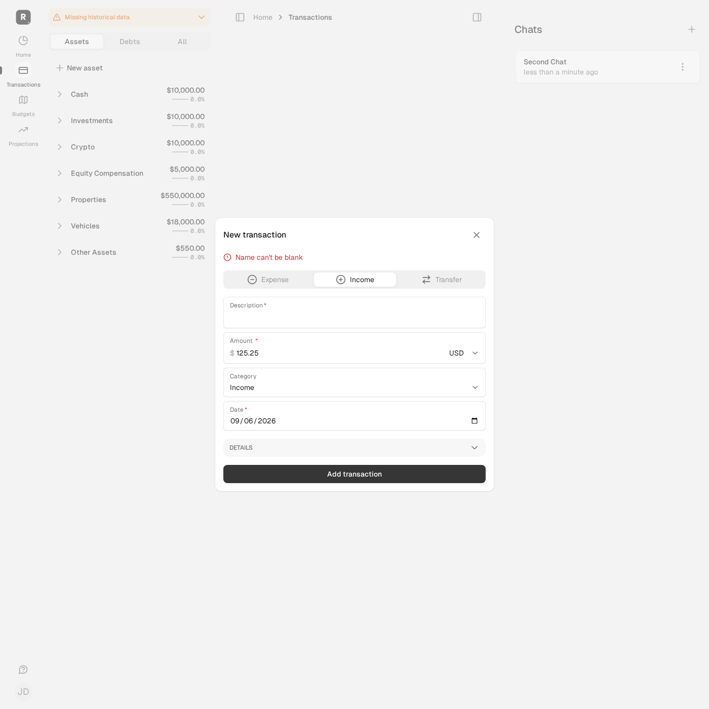
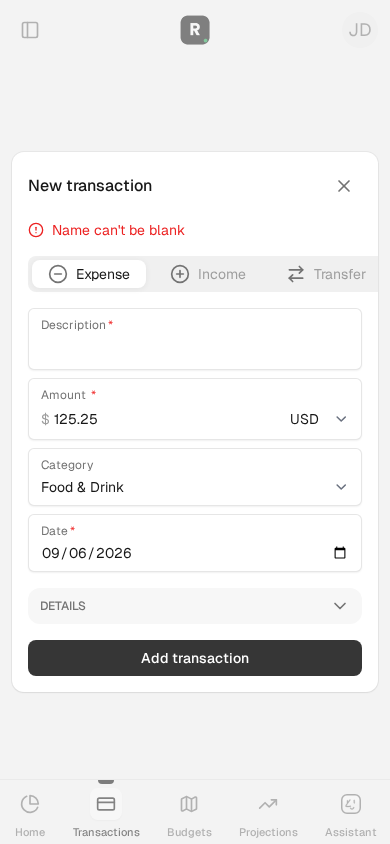

# Issue #152 — recoverable manual transaction creation

These are fresh automated synthetic observations, not production reproduction,
live-provider validation, a human usability study or a screen-reader audit.

## Journey and independent expectations

A fictional family member selects a permitted manual account and submits USD
125.25, dated one month before the test date, with a whitespace-only description.
Native HTML required validation accepts whitespace; the server rejects it. After
two failures, the member repairs **only Description** and submits successfully.

- Desktop income: Income remains active; the income category, positive displayed
  amount and historical date remain selected. The saved signed entry is **-125.25**.
- Mobile expense: Expense and Food & Drink remain selected. The saved entry is
  **+125.25** on the same date and account.
- Both scenarios assert no entry/transaction is persisted during failures, then
  verify the saved amount, date, account and category. The original account choice
  becomes a hidden field on retry, as before; its identity is asserted, not claimed
  visible in the screenshots.

Controller tests also cover zero income, malformed/non-finite amounts, repeated
failures, notes, URL/submission nature disagreement, the unchanged negative-input
sign convention and signed updates without nature. Shared money-field rendering
covers raw blank/zero/negative values, escaped attribute content and unchanged
currency formatting for callers without the raw override.

## Scoped implementation

- Determine form nature from nested submitted intent on creation and top-level
  navigation context on first entry. Use it consistently for tab, hidden nature
  and compatible category choices. Category collections already loaded on new
  **and** create after #151; this PR retains that setup rather than duplicating it.
- Default the date in `new`, not on every form rendering.
- Redisplay the raw submitted amount, not the already signed model amount, so a
  corrected income does not flip sign on resubmission.
- Give the error summary `role="alert"`; no actual screen-reader announcement is
  claimed verified.
- Reject malformed/non-finite creation amounts instead of accepting coerced zero.
  Valid zero and all existing valid signed-amount conventions remain unchanged.
  Strict input checking is creation-only; `update` and `entry_params` are unchanged.

No financial assumptions, household/account policy, provider boundary, schema,
configuration, deployment or retained data changed.

## Fresh local evidence

Branch `automation/issue-152`, based on main `9306e0bf4f495f1ce7c5f9c91d8de9caf49fc5c4`.
Application/test capture HEAD is that base; frozen source-manifest SHA256:
`a5533826afeb32ddc46d31119bd9e49fa770bf48c36c2bf455861e18a145de9b`.
The evidence document/screenshots were added after this capture; they do not
change the tested application or test source. Final committed HEAD and publication
checks are recorded on the PR, not inferred from this precommit capture.

Existing approved sandbox only: helper verifies the ownership-marked synthetic
`roms_autonomy_test` DB and ID/label/network/port-pinned dedicated Redis. Empty
credentials/dotenv, test jobs/mail, Ruby external HTTP blocked, local Capybara
browser requests only. No DB preparation, dependency install, retained-service
startup/restart, live-provider calls or production access.

All commands ran under the common phase lock through `bin/autonomy-check`:

| Command | Fresh result (exit 0 unless noted) |
| --- | --- |
| `preflight` | Existing identities/isolation/offline guards verified |
| `assets:precompile` | Isolated build passed; generated assets only copied back |
| `test test/controllers/transaction_retry_test.rb test/controllers/transactions_controller_test.rb test/controllers/transaction_account_choices_controller_test.rb test/helpers/money_field_test.rb` | 30 tests / 277 assertions / 0 failures / 0 errors / 0 skips |
| `AUTONOMY_BROWSER_EVIDENCE=true bin/autonomy-check test test/system/transaction_retry_test.rb test/system/transaction_account_choices_test.rb` | 5 tests / 65 assertions / 0 failures / 0 errors / 0 skips |
| `test` | 2,111 tests / 10,901 assertions / 0 failures / 0 errors / 16 existing skips |
| `rubocop` | 1,089 files; no offenses |
| `brakeman` | 0 errors / 0 active warnings / 5 ignored warnings |
| `js-lint` | 54 files; no findings or fixes |
| `zeitwerk:check` | Passed; existing non-eager-loaded-directory warning |
| `docs` | Canonical adapters, skills and links passed before evidence additions |

The 16 local skips remain the existing i18n/API/retry/AutoSync and unconfigured
Plaid cases; no new skips were added. Configured dependency audits and full system
suite are delegated to normal PR CI, not reported locally passing. Optional broad
formatting and standalone ERB lint are unrun; the approved helper has no ERB-lint
command. No required local check is blocked, and all helper operations settled.

### Reproduction and corrections

Initial focused checks could not render without generated Tailwind assets (five
errors); the allowed isolated asset build resolved that prerequisite without data
preparation. The fresh pre-fix regression run then produced **5 tests / 29
assertions / 4 failures / 0 errors / 0 skips** at manifest
`ba16a2e1ca9a361a3d3557d632dedce586f4f35ec70e82097163b8e4729fa6fb`.
No pre-fix browser capture is claimed. An initially mistyped test path and a browser
assertion comparing the category label with its ID were corrected; final commands
above passed. Shared-helper test scaffolding was corrected to use independent
renderings rather than resetting internal ActionView test state.

## Independent review and bounds

Two independent read-only reviews found no evidenced blockers. The first suggested
shared raw-value rendering coverage and scrutiny of malformed updates. Source
inspection showed update error templates assume a nonnil amount, so shared strict
parsing was abandoned in favor of creation-only checking; original update behavior
is preserved. Raw-value rendering regressions were added. The final review approved
that scope and sign behavior, with optional stronger malformed-value assertions.

Mission counters: **2/5 cumulative cycles, 1/2 unsuccessful distinct approaches
(conservatively charged shared strict parsing), 1 implementation PR planned**.
Prior completed mission histories/counters/checks/publication outcomes are preserved
privately. No application merge, deployment, release or second issue is authorized.

Remaining limits: malformed-update recovery is pre-existing and out of this
creation-only issue; malformed text can be sanitized by native numeric inputs;
actual screen-reader behavior is unverified. #140 still needs its reviewed
balance-only field allowlist. CI outcome and merge recommendation belong on the PR.

### Synthetic desktop income retry (1400 × 1400)

### Synthetic mobile expense retry (390 × 844)

